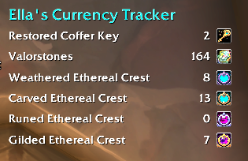

# ✨ Ella's Currency Tracker

> 🌍 Lightweight World of Warcraft addon to track selected currencies with a compact, configurable overlay.

EllasCurrencyTracker displays one line per tracked currency showing the icon, name and current amount. It is small, configurable, and designed to be easy to use in any UI layout.

## Features

- 🔹 Track up to 18 currencies at once (saved per account).
- 💠 Compact overlay with icon + name + amount for each tracked currency.
- ➕ Add currencies using a chat currency link or a numeric currency ID.
- 🔎 Simple settings window with a searchable list of discovered currencies.
- 🔁 Change the overlay's growth direction (UP / DOWN) and move the anchor anywhere on screen.
- 🎨 Customize the currency and title colors from the settings UI.
- ↕️ Reorder tracked currencies via drag-and-drop in the settings.

## Installation

1. Copy the `EllasCurrencyTracker` folder into your WoW AddOns directory.
2. Ensure the folder contains the neccesary items for the addon:
	- `EllasCurrencyTracker.toc`
	- `CurrencyLines.lua`
3. Start or reload WoW and enable the addon from the AddOns menu (or type `/console reloadui`).

## Usage

- ⚙️ Open the configuration window: `/ect config`
- ➕ Add a currency by ID or link: `/ect add <id|link>`
- ➖ Remove a currency from tracking: `/ect remove <id>`
- 📝 List tracked currencies in chat: `/ect list`
- 🔁 Change growth direction: `/ect grow up` or `/ect grow down`
- 📍 Unlock the anchor to move the overlay: `/ect anchor` (toggle)
- ♻️ Reset settings to defaults: `/ect reset`
- ❓ Show help: `/ect help`

### Config Window

- Use the filter box to search discovered currencies by name.
- Click "Add" on a discovered currency to add it to your tracked list.
- Reorder tracked currencies by dragging entries in the right column.
- Use the color pickedr to choose the currency font color and the main title color.

## Configuration (Saved Variables)

Following Settings are stored in the global `EllasCurrencyTrackerDB` table and include:

- `tracked` — array of currency IDs being tracked.
- `grow` — `"UP"` or `"DOWN"` (overlay growth direction).
- `anchor` — table with `point`, `relativePoint`, `x`, `y`, `width`, `scale` for the overlay position.
- `lineHeight` — pixel height for each currency line.
- `font` — path to the font used for currency text.
- `fontColor` — `{r, g, b}` color for currency lines.
- `titleColor` — `{r, g, b}` color for the main title.

You can edit some of these via the settings window or by editing saved variables directly (only if you know what you are doing).

## Contributing

Contributions, bug reports and feature requests are welcome. If you want to contribute:

1. Open an issue describing the change or bug.
2. Fork the repository and create a feature branch.
3. Submit a pull request with a clear description and any testing notes.

Please keep changes small and focused; follow the existing coding style.

## License & Credits

This addon was created by theswiftfox and is licensed under MIT. The WoW API used is subject to the terms of Blizzard Entertainment.

